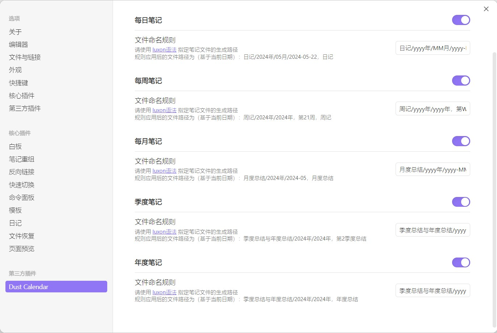

<h1 align="center">Dust Obsidian Calendar</h1>

    
    

    Dust Obsidian Calendar 更符合中国习惯的 Obsidian 插件，它提供了日历浏览以及与日历联动的周期性笔记功能。

## 关于插件

更符合中国习惯的日历插件，支持同时显示公历、农历、星期、节气、节假日、调休等信息，支持切换月视图和年视图，支持关联创建周期性笔记。周期性笔记包括：每日笔记、每周笔记、每月笔记、季度笔记、年度笔记。

## 安装

### 从 Obsidian 的社区插件来安装

1. 打开 `设置/第三方插件`；
2. 关闭 `安全模式`；
3. 点击 `浏览` 按钮来查看第三方插件市场；
4. 输入搜索：**Image Toolkit**；
5. 点击 `安装` 按钮；
6. 一旦安装成功，先关闭当前社区插件窗口，然后在已安装插件列表下激活刚安装的插件；

### 手动安装

1. 下载 [latest release](https://github.com/a-nano-dust/dust-obsidian-calendar/releases/latest)；
2. 解压并提取 dust-obsidian-calendar 文件夹，然后放到你 Obsidian 库中的插件目录中 `<仓库根目录>/.obsidian/plugins/` （注意： `.obsidian` 文件夹可能被隐藏了，我们需要先将该文件夹展示出来）
3. 打开 `设置/第三方插件`，启用该插件。

## 日历视图

鼠标移动到日历顶部的年份区域，年份区域左右会出现切换年份的箭头，点击即可切换年份。日历顶部的月份和季度区域操作方式同理。

点击日历顶部的 `今`，可能会出现以下几种情况：

- 如果已经选中了月视图下的日期，日历视图会切换选中到当前日期；
- 如果已经选中了月视图下的周序号，日历视图会切换选中当前周序号；
- 如果已经选中了年视图下的月份，日历视图会切换选中当前月份；
- 如果已经选中了年视图下的季度序号，日历视图会切换选中当前季度序号。

点击日历顶部的 `月` 或 `年`，可以从月视图切换到年视图，或从年视图切换到月视图。

### 字体大小

如果觉得日历界面的字体大小不合适，我们可以通过插件设置进行调整。目前共提供了三种调整模式：

- 跟随 Obsidian：日历界面的字体大小与 Obsidian 字体大小联动。如果我们开启了快速调整字体大小选项，那么可通过 Ctrl 与鼠标滚轮（或使用触摸板手势）快速调整字体大小。
- 跟随侧边栏：日历界面的字体大小与所在侧边栏的宽度联动。
- 固定大小：需要手动设置日历界面的字体大小。

### 季度命名方式

我们可以在插件设置中调整季度命名方式，选择以 **数字** 命名或以 **春夏秋冬** 命名，这将影响日历头部季度区域和年视图中的季度名称。

## 周期性笔记

首先，我们需要在插件设置中打开对应的选项。

然后，我们需要配置周期性笔记的模板路径（包含笔记所在文件夹和笔记文件名），模板控制字符与 [luxon](https://moment.github.io/luxon/#/formatting?id=table-of-tokens) 相同。

如下展示了一个可能的配置内容：

配置完成后，按照如下方式进行操作即可创建笔记：

- 创建每日笔记：在月视图下双击日期；
- 创建每周笔记：在月视图下双击周序号；
- 创建每月笔记：在年视图下双击月份，或双击日历顶部的月份；
- 创建季度笔记：在年视图下双击季度序号，或双击日历顶部的季度；
- 创建年度笔记：双击日历顶部的年份。

如果与日历关联的每日笔记、每周笔记、每月笔记、季度笔记、年度笔记存在，日历视图会在关联的显示区域下方标注一个 **·** 。

## 联系和反馈

如果你在使用该插件过程中，遇到各种问题、或有什么好的建议，欢迎在 [GitHub issues](https://github.com/a-nano-dust/dust-obsidian-calendar/issues) 中提出。
