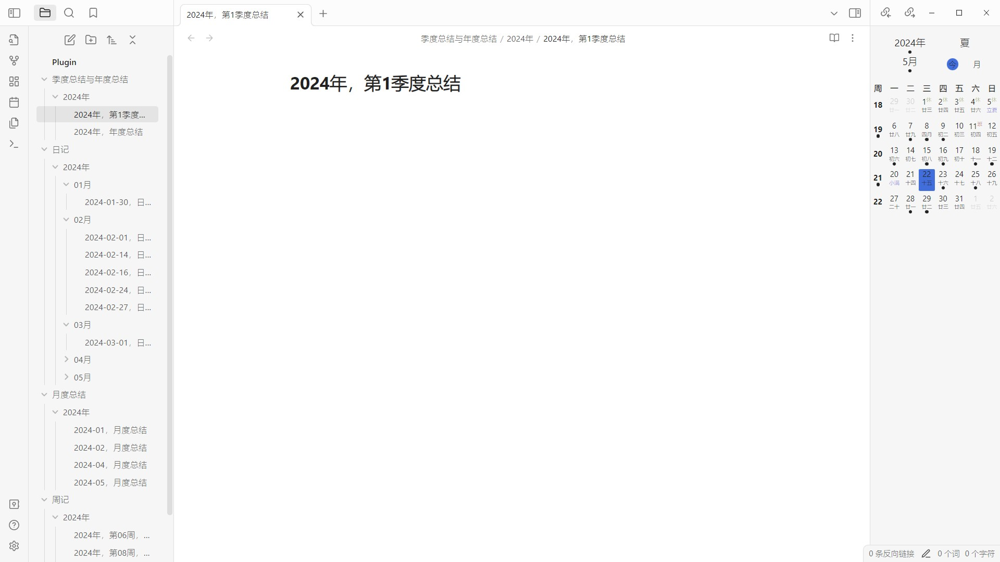

<h1 align="center">Dust Obsidian Calendar</h1>

    
    

    Dust Obsidian Calendar 更符合中国习惯的 Obsidian 插件，它提供了日历浏览以及与日历联动的周期性笔记功能。

## 关于插件

更符合中国习惯的日历插件，支持同时显示公历、农历、星期、节气、节假日、调休等信息，支持切换月视图和年视图，支持关联创建周期性笔记。周期性笔记包括：每日笔记、每周笔记、每月笔记、季度笔记、年度笔记。

## 日历视图

鼠标移动到日历顶部的年份区域，年份区域左右会出现切换年份的箭头，点击即可切换年份。日历顶部的月份和季度区域操作方式同理。

点击日历顶部的 `今`，可能会出现以下几种情况：

- 如果已经选中了月视图下的日期，日历视图会切换选中到当前日期；
- 如果已经选中了月视图下的周序号，日历视图会切换选中当前周序号；
- 如果已经选中了年视图下的月份，日历视图会切换选中当前月份；
- 如果已经选中了年视图下的季度序号，日历视图会切换选中当前季度序号。

点击日历顶部的 `月` 或 `年`，可以从月视图切换到年视图，或从年视图切换到月视图。

## 如何创建周期性笔记

首先，我们需要在插件设置中打开对应的选项。

然后，我们需要配置周期性笔记的模板路径（包含笔记所在文件夹和笔记文件名），模板控制字符与 [luxon](https://moment.github.io/luxon/#/formatting?id=table-of-tokens)
相同。

配置完成后，按照如下方式进行操作即可创建笔记：

- 创建每日笔记：在月视图下双击日期；
- 创建每周笔记：在月视图下双击周序号；
- 创建每月笔记：在年视图下双击月份，或双击日历顶部的月份；
- 创建季度笔记：在年视图下双击季度序号，或双击日历顶部的季度；
- 创建年度笔记：双击日历顶部的年份。

如果与日历关联的每日笔记、每周笔记、每月笔记、季度笔记、年度笔记存在，日历视图会在关联的显示区域下方标注一个 **·** 。

## 安装

## 联系和反馈

如果你在使用该插件过程中，遇到各种问题、或有什么好的建议，欢迎在 [GitHub issues](https://github.com/a-nano-dust/dust-obsidian-calendar/issues)
中提出。